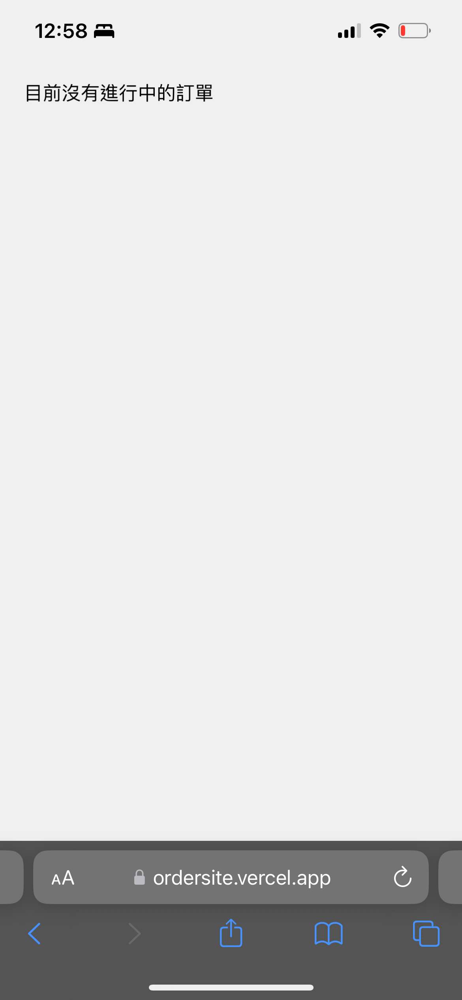
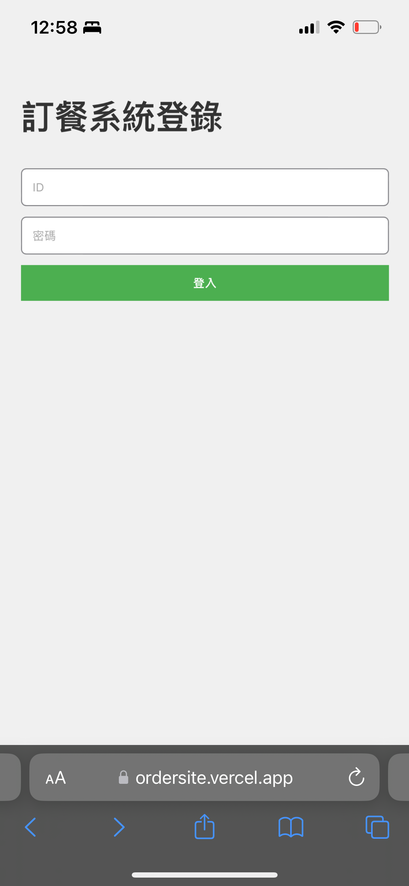
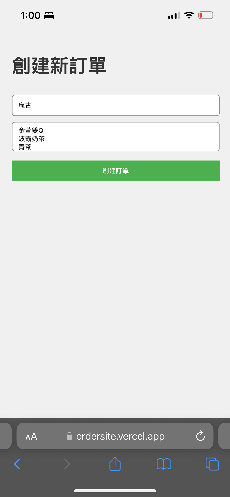
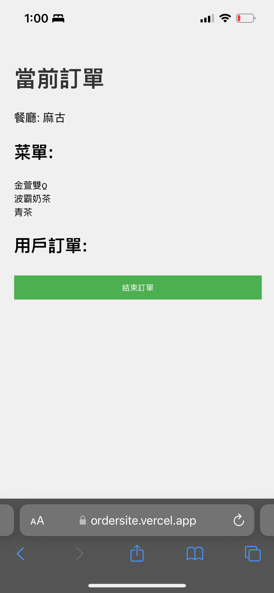
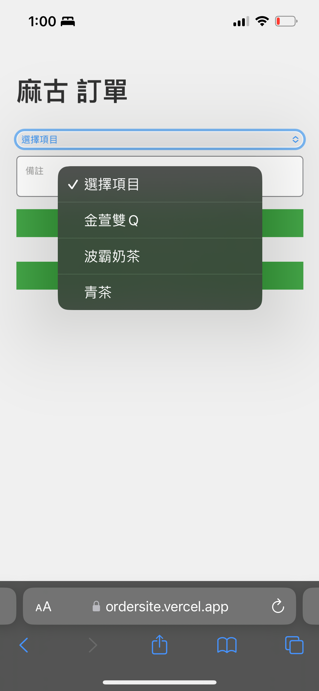
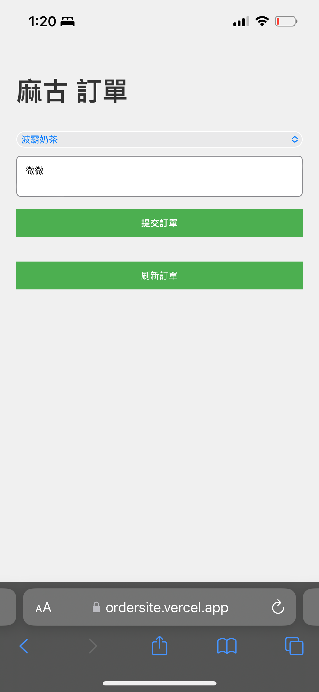
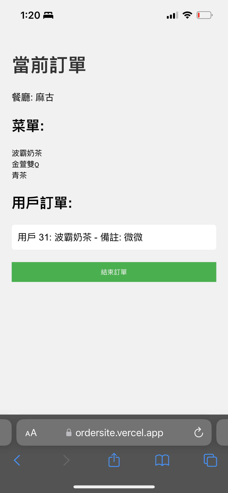

# TNFSH 105 ORDER SYSTEM OPERATION GUIDE

## 登入後的畫面

## 登錄畫面

> (帳號為坐號，密碼為31014坐號
> Ex:
> ID:23
> Password:3101423)

## 管理員創建訂單畫面

## 管理員創建訂單完成後的畫面

## 管理員訂單創建完成後的使用者畫面

## 使用者下單範例

## 有人下單後管理員的畫面

## Project logo

